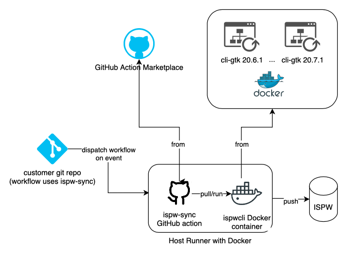

# ispw-sync

This action uses [BMC Compuware ISPW CLI docker container](https://hub.docker.com/r/bmccompuware/ispwcli) to push changesets into ISPW. In order to use [bmc-compuware/ispw-sync@v1](http://github.com/compuware-ispw/ispw-sync) action, the GitHub self-hosted runner launched in the workflow must have the following capabilities:
* support Docker (For example, self-hosted Linux runner with docker, self-hosted Windows with WSL2/Docker or ubuntu-latest)
* access ISPW host and port from the self-hosted runner

GitHub action version vs Docker container version:
| ispw-sync Version | CLI Version | DockerHub |
| :---------- | :---------- | :---------- |
| bmc-compuware/ispw-sync@v1 | v20.6.1.gtk | bmccompuware/ispwcli:v20.6.1.gtk |
| bmc-compuware/ispw-sync@v2 | v20.7.1.gtk | bmccompuware/ispwcli:v20.7.1.gtk |

## Table of Contents
<!-- toc -->

- [ispw-sync](#ispw-sync)
  - [Table of Contents](#table-of-contents)
  - [Usage](#usage)
  - [Inputs](#inputs)
  - [Outputs](#outputs)
  - [Troubleshooting](#troubleshooting)
  - [Relationship between ispw-sync GitHub action and Docker](#relationship-between-ispw-sync-github-action-and-docker)
  - [License Summary](#license-summary)
  - [Limitation](#limitation)

<!-- tocstop -->


## Usage

```yaml
  job_sync:
    runs-on: [self-hosted, ubuntu20]
    name: ISPW Sync
    steps:
      - name: Checkout
        uses: actions/checkout@v2
        with:
          fetch-depth: 0
      - name: Synchronize
        uses: bmc-compuware/ispw-sync@v1
        id: sync
        with:
            host: 'cw09'
            port: 47623
            uid: 'foo'
            pass: ${{ secrets.ISPWPASS }}
            runtimeConfiguration: 'TPZP'
            stream: 'PLAY'
            application: 'PLAY'
            checkoutLevel: 'DEV2'
            gitUid: 'gitfoo'
            gitPass: ${{ secrets.GITHUB_TOKEN }}
            encryptionProtocol: 'None'
            codePage: 1047
            timeout: 0
            showEnv: true
        - name: Output automatic build parameters
            run: echo "automaticBuildJson=${{ steps.sync.outputs.automaticBuildJson }}"
        - name: Output changed programs
            run: echo "changedProgramsJson=${{ steps.sync.outputs.changedProgramsJson }}"
```


## Inputs

| Input name | Required | Description |
| :--------- | :------- | :---------- |
| `host` | **Required** | The ISPW server host. For example, `"cw09"` |
| `port` | **Required** | The ISPW server port. For example, `47623` |
| `encryptionProtocol` | **Optional** | The encryption protocol for the connection (None, Auto, SSLv3, TLS, TLSv1, TLSv1.1, TLSv1.2). Default `"None"`
| `codePage` | **Optional** | The code page for the connection. default, `1047` |
| `timeout` | **Optional** | The timeout (in minutes) for the connection. Default, `0` |
| `uid` | **Required** | The user name for the connection. For example, `"foo"` |
| `pass` | **Required** | The password for the connection. Please use secrets, such as, `${{ secrets.ISPWPASS }}` |
| `runtimeConfiguration` | **Required** | The ISPW server config. For example, `"TPZP"` |
| `stream` | **Required** | The ISPW server stream. For example, `"PLAY"` |
| `application` | **Required** | The ISPW server application. For example, `"PLAY"` |
| `checkoutLevel` | **Required** | The ISPW server level. For example, `"DEV1"` |
| `gitUid` | **Required** | The user name for the GitHub repository. For example, `"gitfoo"` |
| `gitPass` | **Required** | The password, GitHub personal access token or GitHub token for the GitHub repository. Please use secrets, such as, `${{ secrets.GITPASS }}`, `${{ secrets.GITPAT }}` or `${{ secrets.GITHUB_TOKEN }}` |
| `containerCreation` | **Optional** | The option to indicate how often to create a new ISPW container (per-commit, per-branch). Default, `"per-commit"` |
| `containerDescription` | **Optional** | The custom description to be used for the ISPW container. |
| `showEnv` | **Optional** | Show value of environment variables for debugging. Possible values are `true` or `false` |


## Outputs

| Output name | Output type | Description |
| :---------- | :---------- | :---------- |
| `automaticBuildJson` | JSON | The automatic build parameters JSON. For example, `{"containerId":"PLAY004807","releaseId":" ","taskLevel":"DEV2","taskIds":["7E54341E21FF","7E54341E2449","7E54341E2610"]}`|
| `changedProgramsJson` | JSON | The changed programs JSON. For example, `{ version: 1.0.0, programs: [ { version: 1.0.0, programName: TREXX10, programLanguage: CLST, isImpact: false, application: PLAY, stream: PLAY, level: DEV2 }, { version: 1.0.0, programName: TPROG10, programLanguage: COB, isImpact: false, application: PLAY, stream: PLAY, level: DEV2 }, { version: 1.0.0, programName: TPROG11, programLanguage: COB, isImpact: false, application: PLAY, stream: PLAY, level: DEV2 } ] }`|

## Troubleshooting

This action emits debug logs to help troubleshoot failure. To see the debug logs, set the input `showEnv: true`.

## Relationship between ispw-sync GitHub action and Docker

The ispw-sync action if triggered by GitHub workflow will pull ISPW CLI Docker container and run that container to push the change sets to ISPW.



## License Summary

This code is made available under the MIT license.


## Limitation

This action is only available for [Linux virtual environments](https://help.github.com/en/articles/virtual-environments-for-github-actions#supported-virtual-environments-and-hardware-resources) or [Windows with WSL2/Docker](https://docs.docker.com/docker-for-windows/wsl/) support.
